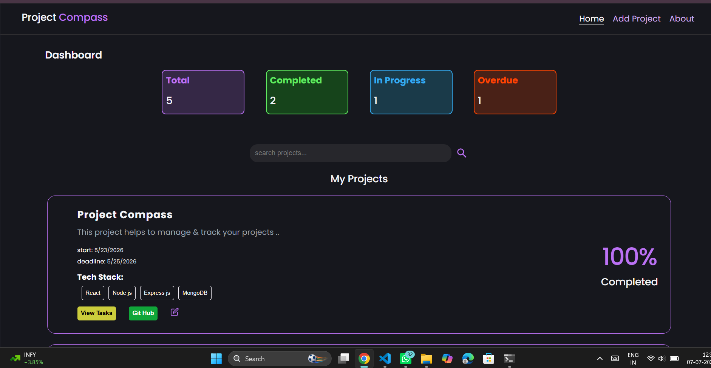
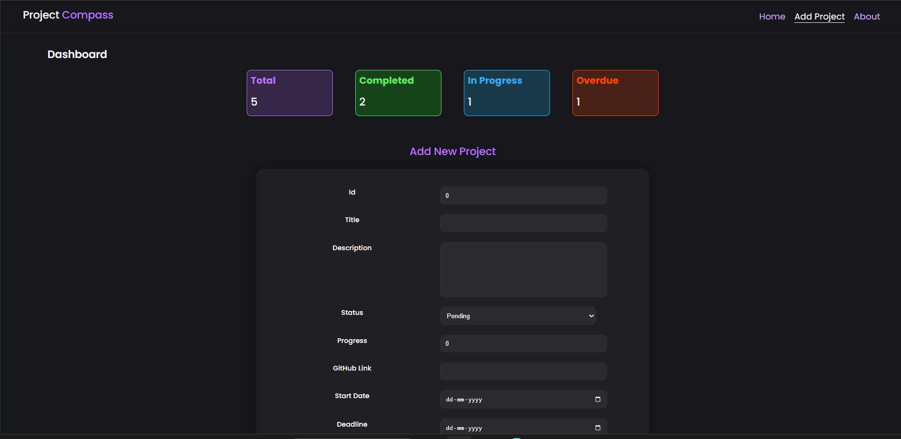
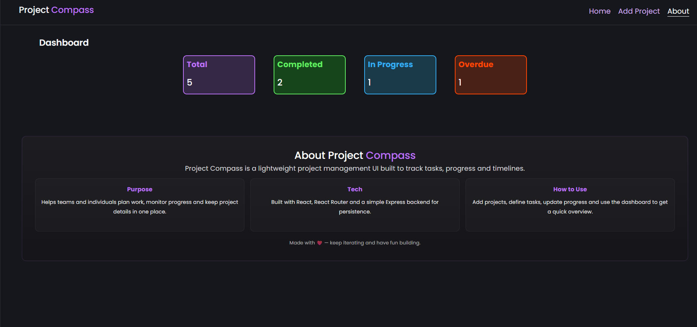

# 🚀 Project Compass

A full-stack **Project Management System** built with the **MERN Stack** to help users manage projects, track progress, organize tasks, and monitor deadlines through a responsive dashboard.


## 📸 Screenshots
<p align="center">
  
  
</p>

<p align="center">
  
</p>

## ✨ Features

- Create, edit, and delete projects
- Manage tasks with priorities and completion status
- Search projects by title
- Track project progress and deadlines
- Store GitHub repository links

## 🛠️ Tech Stack

- **Frontend:** React.js, React Router, Axios, CSS
- **Backend:** Node.js, Express.js
- **Database:** MongoDB, Mongoose

## 📚 Concepts Used

- React Hooks (`useState`, `useEffect`)
- RESTful APIs
- CRUD Operations
- Express Routing
- Async/Await
- MongoDB Schema Design
- Frontend–Backend Integration

## 🚀 Getting Started

```bash
git clone https://github.com/Akshitha-Mothkur/Project-Management-System.git

cd backend
npm install
npm start

cd ../frontend
npm install
npm run dev
```


## 👩‍💻 Author

**Akshitha Mothkur**

GitHub: https://github.com/Akshitha-Mothkur